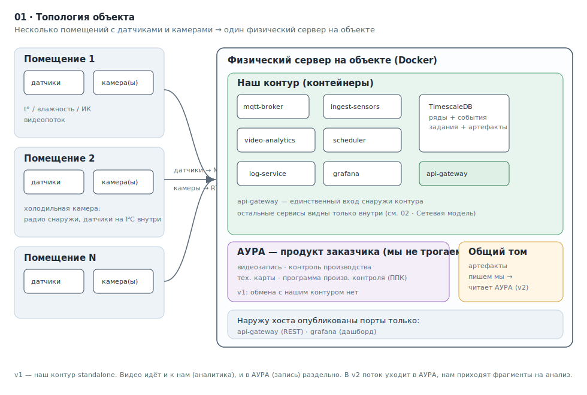

# Система мониторинга помещений · спецификация для разработки

<p align="center">
  
  
  
  
  
</p>

Пакет проектной документации и плана работ для развёртывания комплекса силами
Claude Code. Заказчик — владелец продукта **АУРА**; мы разрабатываем подсистему
**датчиков и видеоаналитики**, которая работает на одном сервере с АУРА.

> [!NOTE]
> **Это репозиторий-спецификация.** Здесь нет прикладного кода — здесь
> архитектура, контракты, диаграммы и план работ. Код создаётся по этому плану
> (Claude Code разворачивает рабочий репозиторий по
> [`docs/06_BUILD_PLAN.md`](docs/06_BUILD_PLAN.md)).

---

## С чего начать (Claude Code)

```text
CLAUDE.md  →  docs/00_BEST_PRACTICES_CODE.md  →  docs/01…05  →  docs/06_BUILD_PLAN.md
 правила          как мы работаем                архитектура        эпики и issue
```

1. Прочитай **[`CLAUDE.md`](CLAUDE.md)** — постоянные правила (язык, дробление задач, границы).
2. Прочитай **[`docs/00_BEST_PRACTICES_CODE.md`](docs/00_BEST_PRACTICES_CODE.md)** — как мы организуем работу.
3. Прочитай документы архитектуры по порядку (**[01](docs/01_ARCHITECTURE.md) → [05](docs/05_SECURITY_CODE_PROTECTION.md)**).
4. Переходи к **[`docs/06_BUILD_PLAN.md`](docs/06_BUILD_PLAN.md)** — эпики и атомарные
   задачи. С него начинается реальная работа: заводишь issue по плану и идёшь по ним.

---

## Локальный запуск (dev)

**Требования:** Docker + Docker Compose, Python 3.12.

```bash
# 1. Конфигурация окружения (секреты — только локально, .env в .gitignore)
cp .env.example .env
#    отредактируй .env: задай POSTGRES_PASSWORD, API_KEY и прочие пароли

# 2. Поднять базу (TimescaleDB; healthcheck по pg_isready)
docker compose up -d db
#    прикладные сервисы (ingest-sensors, log-service, video-analytics,
#    api-gateway, scheduler, media-gateway, grafana, mqtt-broker)
#    добавляются по мере эпиков E2–E9

# 3. Проверки кода — тот же набор, что и в CI
pip install -r requirements-dev.txt
scripts/check.sh        # ruff (линт+формат) → mypy (типы) → pytest (тесты)
```

CI ([`.github/workflows/ci.yml`](.github/workflows/ci.yml)) прогоняет `ruff` +
`mypy` + `pytest` на каждый PR и push в `main`.

---

## Карта документации

| № | Документ | О чём | Кому полезно |
|:--:|---|---|---|
| — | [`CLAUDE.md`](CLAUDE.md) | Постоянные инструкции для Claude Code | Claude Code |
| 00 | [`docs/00_BEST_PRACTICES_CODE.md`](docs/00_BEST_PRACTICES_CODE.md) | Лучшая практика работы с Claude Code на этом проекте | команда |
| 01 | [`docs/01_ARCHITECTURE.md`](docs/01_ARCHITECTURE.md) | Верхнеуровневая архитектура, стек, структура репозитория | все |
| 02 | [`docs/02_NETWORK.md`](docs/02_NETWORK.md) | Сетевая модель контейнеров (две сети + общий том), обоснование | DevOps · заказчик |
| 03 | [`docs/03_API_CONTRACT.md`](docs/03_API_CONTRACT.md) | REST/JSON контракт: кто кому что шлёт, эндпойнты, конверты | бэкенд |
| 04 | [`docs/04_DATA_MODEL.md`](docs/04_DATA_MODEL.md) | Схема БД, схемы события / задания / артефакта | бэкенд · БД |
| 05 | [`docs/05_SECURITY_CODE_PROTECTION.md`](docs/05_SECURITY_CODE_PROTECTION.md) | Защита кода в контейнере: пределы и меры по уровням | заказчик · DevOps |
| 06 | [`docs/06_BUILD_PLAN.md`](docs/06_BUILD_PLAN.md) | Эпики → атомарные задачи → шаблон issue → метки | планирование |
| 07 | [`docs/07_VIDEO_ANALYTICS.md`](docs/07_VIDEO_ANALYTICS.md) | Спецификация движка аналитики (перенос рабочего PoC) | аналитика |
| — | [`docs/diagrams/`](docs/diagrams/README.md) | Диаграммы (BPMN 2.0 для процессов + SVG для топологии/сети) | все |

---

## Топология (обзор)

<p align="center">
  
</p>

> Остальные схемы — сетевая модель, коллаборация API, жизненный цикл задания,
> поток события — собраны в [`docs/diagrams/README.md`](docs/diagrams/README.md).

---

## Ключевые решения (кратко)

- **Один физический сервер на объекте.** В контейнерах: наш контур + АУРА.
- **v1 — standalone.** Без интеграции с АУРА, но с готовыми (заглушёнными) разъёмами.
- **Стек:** Python 3.12 / FastAPI, TimescaleDB, Mosquitto (MQTT), MediaPipe
  `PoseLandmarker`, go2rtc (медиа-шлюз), Grafana, Docker Compose.
- **Видеоаналитика — перенос рабочего PoC** (`motion-log.html`), не разработка с
  нуля: события/действия, ROI-зоны, % покрытия, эвристика «белого халата».
  См. [`07`](docs/07_VIDEO_ANALYTICS.md).
- **Датчики** — по решению проекта: ESP32-C3 + SHT41/SHT40 + MLX90614 на I²C,
  ESPHome, MQTT; холодильные камеры — радио снаружи, датчики на I²C-шлейфе.
- **Видео в v1** идёт и к нам (аналитика), и в АУРА (запись) — двумя независимыми
  потребителями. В v2 поток уходит в АУРА, а нам прилетают фрагменты на анализ.
- **Видеоаналитика по расписанию** (не на каждом потоке постоянно) — нагрузка
  низкая, GPU не требуется (проверено на PoC).
- **Защита кода:** полностью закрыть от владельца хоста нельзя; поднимаем планку
  компиляцией (Nuitka) + distroless + юридическим контуром. Детали — в
  [`05`](docs/05_SECURITY_CODE_PROTECTION.md).

---

## Граница v1 / v2

| Что | v1 (сейчас) | v2 (потом) |
|---|---|---|
| Наш контур (датчики, аналитика, лог) | **полностью рабочий** | то же + интеграция |
| REST-разъёмы для АУРА (`/integration/*`) | **есть, заглушены** (501 / фичефлаг) | включаются |
| Триггер аналитики | по расписанию (наш планировщик) | + по команде АУРА (REST) |
| Источник видео для аналитики | RTSP-поток (`stream`) | `stream` ИЛИ файл/фрагмент от АУРА (`file`) |
| Сеть `integration` (Docker) | создаётся, обмена нет | по ней идёт обмен с АУРА |

Полная таблица и правила — [`CLAUDE.md` §4](CLAUDE.md) и [`docs/01_ARCHITECTURE.md` §7](docs/01_ARCHITECTURE.md).

---

## Диаграммы

Процессные диаграммы выполнены в **BPMN 2.0** (файлы `.bpmn`, открываются в
Camunda Modeler / bpmn.io) с SVG-превью. Топология и сетевая модель — это
**статические структуры**, BPMN их не моделирует, поэтому они даны как
архитектурные SVG-диаграммы. Подробнее — в
[`docs/diagrams/README.md`](docs/diagrams/README.md).

---

## Структура репозитория

```text
.
├─ CLAUDE.md                  # постоянные инструкции для Claude Code
├─ README.md                  # этот файл
└─ docs/                      # документация — источник истины
   ├─ 00…07_*.md              # практики, архитектура, контракты, план работ
   └─ diagrams/               # BPMN 2.0 (.bpmn + .svg) и архитектурные SVG
```

Целевая структура рабочего монорепо (сервисы, БД, прошивки, Grafana) описана в
[`docs/01_ARCHITECTURE.md` §8](docs/01_ARCHITECTURE.md) — её Claude Code разворачивает
по плану работ.
