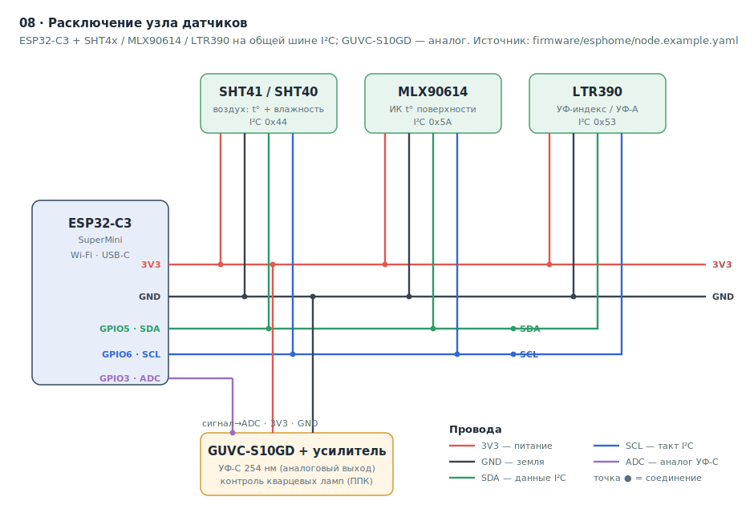
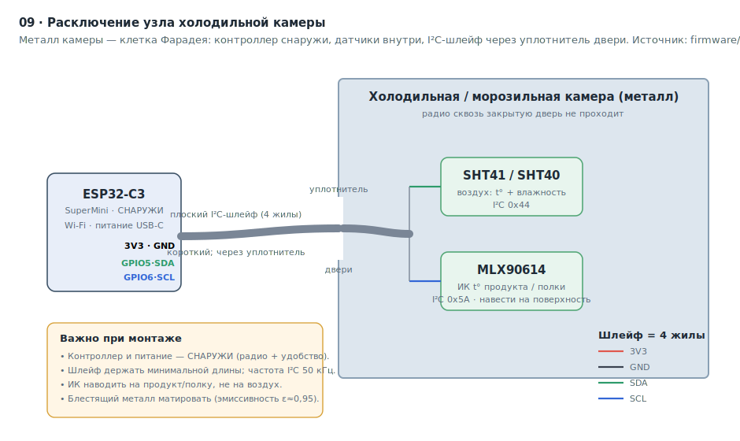

# 11 · Железо узла датчиков

Раздел для **монтажника и наладчика**: из чего собирается узел датчиков, как его
расключить, чем и как прошить, и как при необходимости поправить прошивку. Узлы
датчиков физически **не входят** в Docker-контур — контроллер сам подключается к
Wi-Fi и публикует показания в MQTT-брокер сервера (`docs/02_NETWORK.md`,
контракт топиков — `docs/08_MQTT_CONTRACT.md`).

Эталон конфигов, на которые опирается этот раздел:
[`firmware/esphome/node.example.yaml`](../firmware/esphome/node.example.yaml)
(обычный узел) и
[`firmware/esphome/cold_chamber.example.yaml`](../firmware/esphome/cold_chamber.example.yaml)
(холодильная камера). **Распиновка ниже = пины в этих файлах** (сверяется
тестом `tests/test_hardware_doc.py`).

---

## 1. Состав узла (спецификация, BOM)

Один узел контролирует одно помещение. Минимальный набор — контроллер + датчик
воздуха; ИК и УФ добавляются по задаче помещения.

| Компонент | Модель | Что измеряет | Интерфейс | Метрика (MQTT) |
|---|---|---|---|---|
| Контроллер | **ESP32-C3 SuperMini** | — (Wi-Fi, питание, прошивка) | USB-C, Wi-Fi | — |
| Воздух | **SHT41 / SHT40** | температура + влажность | I²C `0x44` | `air_temp`, `humidity` |
| Поверхность | **MLX90614 / GY-906** | бесконтактная ИК-температура | I²C `0x5A` | `surface_ir` |
| УФ-индекс | **LTR390** | общий УФ-индекс / УФ-A | I²C `0x53` | `uv_index` |
| УФ-C | **GUVC-S10GD** + усилитель | бактерицидный УФ-C 254 нм | аналог (ADC) | `uv_c` |

**Что нужно ещё:** провода/перемычки (Dupont), плоский шлейф для холодильной
камеры (см. §3), кабель **USB-C** для первой прошивки, блок питания 5 В USB для
постоянной работы. Пайка не обязательна, если модули с гребёнкой и используется
макетная/монтажная колодка, но для стационарной установки соединения лучше
пропаять.

> Не все датчики обязательны. Без УФ-контроля (кварцевые лампы) блоки `ltr390` и
> `uv_c` из прошивки удаляются — см. §7. Узлы холодильных камер обычно ставят
> только воздух + ИК.

---

## 2. Расключение обычного узла

Все цифровые датчики висят на **одной шине I²C** (общие SDA/SCL/3V3/GND), УФ-C —
на аналоговом входе АЦП. I²C-адреса не конфликтуют, поэтому датчики подключаются
параллельно на те же две линии.



### Таблица соединений

| Пин ESP32-C3 | Линия | Куда идёт |
|---|---|---|
| `3V3` | питание | VCC всех датчиков (SHT4x, MLX90614, LTR390, GUVC) |
| `GND` | земля | GND всех датчиков |
| `GPIO5` | **SDA** (I²C данные) | SDA: SHT4x + MLX90614 + LTR390 |
| `GPIO6` | **SCL** (I²C такт) | SCL: SHT4x + MLX90614 + LTR390 |
| `GPIO3` | **ADC** (аналог) | сигнальный выход усилителя GUVC-S10GD |

**Проверка пайки до прошивки не нужна:** в конфиге включён `i2c: scan: true` —
при старте контроллер распечатает в лог найденные I²C-адреса (`0x44`, `0x53`,
`0x5A`). Если адреса не видны — проверьте SDA/SCL (не перепутаны ли), питание и
землю. Подтяжки (pull-up) на SDA/SCL обычно уже стоят на модулях датчиков;
дополнительные не нужны.

> **Питание датчиков — 3,3 В.** ESP32-C3 работает от 3,3 В, его GPIO **не
> толерантны к 5 В**. Берите VCC датчиков с пина `3V3`, а не `5V`/`VBUS`.

---

## 3. Расключение узла холодильной/морозильной камеры

Металлическая камера — клетка Фарадея: радио сквозь закрытую дверь не проходит, и
питание внутри неудобно. Поэтому **контроллер с Wi-Fi и питанием — снаружи**, а
датчики (воздух + ИК) — **внутри** на коротком плоском I²C-шлейфе, проложенном
через уплотнитель двери (плоский шлейф не нарушает прилегание уплотнителя).



Отличия от обычного узла (всё уже учтено в `cold_chamber.example.yaml`):

- **Шлейф — минимальной длины.** Длинный I²C ненадёжен; в конфиге частота шины
  понижена до `frequency: 50kHz` — при длинном шлейфе это снимает сбои.
- **ИК наводить на продукт/полку, а не на воздух** — MLX90614 меряет температуру
  поверхности, на которую смотрит.
- **Эмиссивность.** По матовым поверхностям ε≈0,95 (по умолчанию верно). По
  блестящему металлу показания занижены — поверхность матировать (краска/лента)
  или вводить поправку.
- Помещение в справочнике помечается `is_cold=true` (`rooms`), для него обычно
  задаётся более строгий порог температуры.

---

## 4. Чем прошивать

| Инструмент | Зачем | Установка |
|---|---|---|
| **ESPHome** | компиляция и заливка прошивки из YAML | `pip install esphome` (Python 3.x) |
| Кабель **USB-C** | первая прошивка по проводу | — (data-кабель, не «только зарядка») |
| Драйвер USB-Serial | чтобы ПК увидел плату как COM-порт | обычно ESP32-C3 определяется как родной USB; для плат с CH340/CP2102 — драйвер производителя |

ESPHome ставится один раз на машину наладчика (не на сервер). Прошивка идёт **с
этой машины**, она должна быть в той же Wi-Fi-сети, что и узел (для OTA).

---

## 5. Пошаговая прошивка

### Шаг 1. Секреты (один раз на объект)

```bash
cd firmware/esphome
cp secrets.yaml.example secrets.yaml      # secrets.yaml в .gitignore — не коммитится
```
Заполнить `secrets.yaml`:
- `wifi_ssid` / `wifi_password` — сеть объекта, в которой стоит сервер;
- `mqtt_broker` — **IP сервера** (там слушает контейнер `mqtt-broker`, порт 1883);
- `ota_password` — пароль для обновлений по воздуху.

### Шаг 2. Завести узел в справочнике (до прошивки)

`node_id` в прошивке **обязан совпадать** с `sensor_nodes.id` в справочнике —
иначе `ingest-sensors` отбросит показания как «неизвестный узел». Завести можно:
- в GUI: http://<сервер>:8000/ui/ → вкладка **«Объект»** → «Узлы датчиков»;
- или по REST: `POST /api/v1/sensor-nodes` (`docs/03_API_CONTRACT.md`).

### Шаг 3. Конфиг узла из эталона (по файлу на каждый физический узел)

```bash
cp node.example.yaml node-03.yaml          # для холодильной — cold_chamber.example.yaml
```
В `node-03.yaml` поправить только блок `substitutions`:
```yaml
substitutions:
  node_id: node-03
  topic_base: monitoring/node-03
```

### Шаг 4. Прошить — первый раз по USB

Подключить плату к ПК кабелем USB-C и выполнить:
```bash
esphome run node-03.yaml
```
ESPHome скомпилирует прошивку и предложит порт (USB) — выбрать его. После заливки
в логе появятся подключение к Wi-Fi, MQTT и строки `i2c` со списком адресов.

### Шаг 5. Дальнейшие обновления — по воздуху (OTA)

После первой USB-прошивки плата доступна по Wi-Fi. Любую правку конфига
заливать без провода — той же командой:
```bash
esphome run node-03.yaml                   # ESPHome сам найдёт узел в сети (OTA)
```

### Шаг 6. Проверить, что показания идут

На сервере (или с ПК, если брокер доступен):
```bash
mosquitto_sub -h <IP-сервера> -t 'monitoring/#' -v
```
Должны побежать строки вида `monitoring/node-03/air_temp {"value": 23.4, "unit": "C"}`.
Либо открыть Grafana (http://<сервер>:3000) — через ~минуту появятся ряды, либо
обзорный экран дежурного (http://<сервер>:8000/ui/overview.html).

---

## 6. Проверка и приёмка узла

- [ ] В логе ESPHome при старте видны I²C-адреса нужных датчиков.
- [ ] Узел подключился к Wi-Fi и MQTT (строки в логе).
- [ ] `node_id` совпадает с `sensor_nodes.id` (иначе показания молча отбрасываются).
- [ ] В `mosquitto_sub` / Grafana идут все ожидаемые метрики помещения.
- [ ] Значения правдоподобны (t° воздуха комнатная, влажность 30–60 % и т.п.).
- [ ] ИК-датчик наведён на контролируемую поверхность (не на воздух).

---

## 7. Как модифицировать прошивку

Прошивка — это **YAML без кода** (ESPHome). Правки — в копии узла (`node-03.yaml`),
затем `esphome run node-03.yaml` (по OTA). Источник всех примеров —
[`firmware/esphome/node.example.yaml`](../firmware/esphome/node.example.yaml).

### Убрать ненужный датчик

Удалить соответствующий блок из секции `sensor:`. Например, без УФ-контроля —
убрать блоки `platform: ltr390` и `platform: adc` (`uv_c`). Контроллер перестанет
публиковать `uv_index`/`uv_c`; в журнале это не вызовет ошибок.

### Добавить датчик

Добавить блок `platform: …` в `sensor:` по образцу существующих и опубликовать
его значение в свой топик через `on_value → mqtt.publish` (формат payload —
`{"value": …, "unit": "…"}`, см. `docs/08_MQTT_CONTRACT.md`). Новая метрика должна
быть из списка v1 (`air_temp|humidity|surface_ir|uv_index|uv_c`) — иначе
`ingest-sensors` её не распознает (расширение списка метрик — отдельная задача).

### Калибровка УФ-C (обязательно при установке GUVC-S10GD)

В эталоне фильтр на аналоговом входе — **пример**:
```yaml
filters:
  - lambda: return x * 10.0;   # ПРИМЕР — заменить под свой модуль усиления
```
Коэффициент подбирается под конкретную схему усиления (напряжение → мВт/см²) по
эталонному источнику УФ-C. Без калибровки значения `uv_c` условны.

### Эмиссивность ИК (MLX90614)

Для блестящих поверхностей показания занижены. Решение монтажом — матировать
поверхность (ε≈0,95) или вводить поправку (см. §3). Программная установка
эмиссивности MLX90614 — расширение, в эталоне не задействована.

### Интервал опроса

`update_interval: 60s` в каждом блоке датчика. Уменьшать без нужды не стоит —
чаще = больше трафика и нагрев датчика; 60 с достаточно для контроля среды.

### Сменить пины I²C / ADC

Менять только при другой разводке платы — в блоке `i2c:` (`sda`/`scl`) и в
`pin:` аналогового датчика. **Если меняете пины — синхронно поправьте этот раздел
и эталонные YAML** (иначе разойдётся с тестом-стражем `tests/test_hardware_doc.py`).

---

## 8. Частые проблемы

| Симптом | Причина / решение |
|---|---|
| В логе нет I²C-адресов | Перепутаны SDA/SCL, нет питания/земли, плохой контакт. Сверить с §2. |
| Датчик питается от 5 В и «глючит» | VCC брать с `3V3`, не с `5V` — GPIO ESP32-C3 не толерантны к 5 В. |
| Показания идут, но не видны на сервере | `node_id` ≠ `sensor_nodes.id` — `ingest-sensors` отбрасывает как неизвестный узел (§5 шаг 2). |
| Нет данных от узла в холодильной камере | Контроллер внутри металла (нет Wi-Fi) — вынести наружу, датчики на шлейфе (§3). |
| Сбои I²C на длинном шлейфе | Понизить частоту шины (`frequency: 50kHz`), укоротить шлейф. |
| OTA не находит узел | ПК и узел в разных сетях/VLAN; первый раз прошить по USB. |
| `uv_c` даёт ерунду | Не откалиброван фильтр аналогового входа (§7). |
| ИК-температура занижена | Блестящая поверхность — матировать или поправка эмиссивности (§3). |

---

## 9. Связанные документы

- Контракт MQTT (топики и payload) — [`docs/08_MQTT_CONTRACT.md`](08_MQTT_CONTRACT.md).
- Модель данных и метрики — [`docs/04_DATA_MODEL.md`](04_DATA_MODEL.md).
- Сетевая модель (где сервер и брокер) — [`docs/02_NETWORK.md`](02_NETWORK.md).
- Эталонные прошивки — [`firmware/esphome/`](../firmware/esphome/).
- Исследования по железу (комбо-узел камера+датчики, mesh для трудных радиозон) —
  [`docs/research/`](research/).
