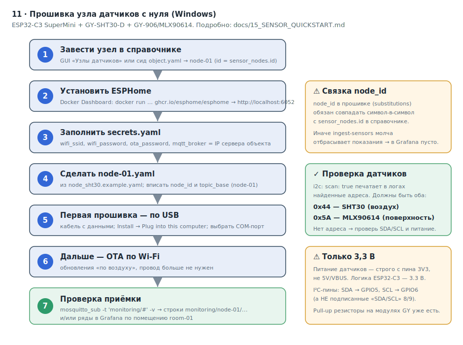

# 15 · Пошаговая сборка и прошивка узла датчиков с нуля (Windows)

> Руководство для новичка: как из коробочного комплекта собрать рабочий узел
> датчиков и прошить его **на Windows**, ничего не зная заранее. Подробная
> спецификация железа и схемы — в [`11_HARDWARE.md`](11_HARDWARE.md); здесь —
> «возьми и сделай» под конкретный комплект.

**Комплект, под который написано руководство (на каждый узел):**

- **ESP32-C3 SuperMini** — контроллер. Подключает датчики, выходит в Wi-Fi, сам
  шлёт показания на сервер.
- **GY-SHT30-D** — датчик воздуха (температура + влажность). Чип **SHT30**,
  в ESPHome платформа `sht3xd`, I²C-адрес `0x44`.
- **GY-906 (MLX90614)** — бесконтактный ИК-датчик температуры поверхности.
  Платформа `mlx90614`, I²C-адрес `0x5A`.

УФ-датчиков (LTR390, GUVC-S10GD) в этом комплекте **нет** — в конфиг они не входят.

**Что получим:** узел раз в минуту публикует по Wi-Fi три показания —
температура воздуха, влажность, ИК-температура поверхности — в MQTT сервера, и
они появляются в Grafana.

**Общая картина процесса** — `docs/diagrams/11_flashing_flow.svg`:



---

## 0. Что понадобится

| Категория | Что именно |
|---|---|
| Железо | ESP32-C3 SuperMini, GY-SHT30-D, GY-906/MLX90614, провода (Dupont или пайка), **USB-кабель с передачей данных** (не «только зарядка») |
| ПО | Windows 10/11, браузер Chrome или Edge, установленный Docker (для ESPHome) |
| Доступы | Wi-Fi сети объекта (SSID + пароль), IP сервера объекта (где работает MQTT-брокер) |
| Доступ к серверу | возможность завести узлы в справочнике (GUI/REST или сид) |

---

## 1. Сборка узла: что с чем соединить

Оба датчика — цифровые, общаются по одной шине **I²C** (две сигнальные линии:
SDA и SCL). Поэтому они вешаются **параллельно** на одни и те же два пина
контроллера плюс общее питание и земля. Разные адреса (`0x44` и `0x5A`) не
конфликтуют — контроллер их различает сам.

На контроллере нужны всего **четыре пина**: `3V3` (питание), `GND` (земля),
`GPIO5` (это **SDA**) и `GPIO6` (это **SCL**).

> **⚠ Шёлкография на плате обманывает.** На самой плате пины могут быть подписаны
> `SDA`/`SCL` рядом с цифрами 8 и 9 — **это не те пины**. Прошивка использует
> физические **GPIO5 (SDA)** и **GPIO6 (SCL)**. Подключайте датчики именно к 5 и 6.

### Таблица соединений

На каждый из четырёх пинов контроллера приходит **по два провода** (один от
SHT30, один от GY-906):

| Вывод модуля датчика | GY-SHT30-D | GY-906 (MLX90614) | Пин ESP32-C3 |
|---|---|---|---|
| Питание (`VIN`/`VCC`) | да | да | **3V3** |
| Земля (`GND`) | да | да | **GND** |
| Данные I²C (`SDA`) | да | да | **GPIO5** |
| Такт I²C (`SCL`) | да | да | **GPIO6** |
| Выбор адреса (`ADDR`/`ADR`) | не подключать | (нет вывода) | — |

Контакт `ADDR` на GY-SHT30-D **не трогаем** — по умолчанию адрес `0x44`, он и
нужен. **Подтягивающие резисторы ставить не нужно** — на модулях GY они уже
распаяны.

### Тест и боевой узел

1. **Для проверки на столе — без пайки.** Беспаечная макетка или провода-перемычки
   Dupout. Быстро, ничего не портит, удобно убедиться, что датчики «видятся».
   Минус — контакты разбалтываются, для постоянной установки не годится.
2. **Для боевого узла — пайка.** Когда схема проверена и показания идут, спаяйте
   соединения — они не отвалятся от вибрации и не окислятся.

> **Сначала собрать и проверить, потом паять.** В прошивке включён `i2c: scan:
> true`: при старте контроллер печатает в лог найденные I²C-адреса. Видны `0x44`
> и `0x5A` — соединения верные.

### ⚠ Только 3,3 В

ESP32-C3 — трёхвольтовый, его выводы (включая SDA/SCL) **не переносят 5 В**.
Питание датчиков берите **строго с пина `3V3`**, а не с `5V`/`VBUS`. Иначе можно
повредить логику контроллера.

### Куда ставить датчики

- **GY-SHT30-D (воздух)** — в рабочей зоне, не вплотную к двери/окну/обогревателю/
  вытяжке, корпус должен свободно обдуваться (без герметичной коробки).
- **GY-906 (ИК)** — «термометр направленного действия»: наведите «глазок» на
  контролируемую **поверхность** (полку, продукт, стол), а не в воздух.

Распиновка контроллера — `docs/diagrams/10_esp32c3_pinout.svg`; схема расключения
— `docs/diagrams/08_node_wiring.svg`.

---

## 2. Установка ESPHome на Windows

ESPHome превращает короткий YAML-файл (текстовый конфиг) в прошивку для ESP32-C3
и заливает её в плату. Писать код не нужно — вы описываете «что подключено».

### Какой способ выбрать

| Способ | Что нужно | Плюсы | Минусы |
|---|---|---|---|
| **1. ESPHome Dashboard в Docker** (рекомендую) | Docker уже стоит | Веб-интерфейс, редактор YAML, сборка, USB-прошивка и OTA, ничего не ставить в Windows | Первая компиляция долгая (один раз качает тулчейн; дальше кэш на docker-томе ускоряет сборки) |
| **2. ESPHome CLI через Python** | Python 3.11+ | Полный контроль из командной строки | Нет веб-интерфейса; новичку легче ошибиться |
| **3. ESPHome Web** (web.esphome.io) | Chrome/Edge + кабель | Ничего не ставить, прошить из браузера | Не компилирует сложный YAML — только «оживить» плату |

### Способ 1 (рекомендуемый): ESPHome Dashboard через Docker

ESPHome уже включён в сборку как сервис `esphome` (профиль `tools`) — отдельно
ничего ставить не нужно. Из корня проекта:

```powershell
docker compose --profile tools up -d esphome
```

Сервис поднимет ESPHome Dashboard и «прокинет» в него папку `firmware/esphome`
(там ваши `*.yaml` и `secrets.yaml`). Версию образа можно закрепить переменной
`ESPHOME_VERSION` в `.env` (по умолчанию `latest`). Остановить: `docker compose
--profile tools down`.

> **Почему сборка не тормозит из-за Windows.** Тулчейн PlatformIO (тысячи мелких
> файлов) и объектные файлы сборки лежат не на медленном Windows-мэппинге, а на
> отдельных docker-томах `esphome_cache` (`/cache`) и `esphome_build` (`/build`) —
> ESPHome подхватывает их автоматически (#354). Тулчейн качается один раз и
> переживает `down`/`up`, поэтому первая сборка медленная, а повторные — быстрые.
> Сами конфиги (`*.yaml`, `secrets.yaml`) остаются в `firmware/esphome` и видны
> в dashboard как обычно. Чистый сброс кэша (если понадобится):
> `docker volume rm autom_for_varnaev_esphome_cache autom_for_varnaev_esphome_build`.

Откройте в браузере **http://localhost:6052** — это ESPHome Dashboard: правка
конфигов, кнопка **Install** (сборка и заливка) и обновление по воздуху (OTA).

> Альтернатива без compose (разовый запуск): зайдите в папку `firmware\esphome`
> и выполните
> `docker run --rm -p 6052:6052 -e ESPHOME_DASHBOARD_USE_PING=true -v "${PWD}:/config" -it ghcr.io/esphome/esphome`.

> Первая прошивка по USB из контейнера на Windows часто недоступна (проброс
> COM-порта ограничен) — для неё используйте ESPHome Web (способ 3); дальше
> обновления идут по Wi-Fi (OTA), и сервиса `esphome` достаточно. На Linux-сервере
> объекта для USB-прошивки раскомментируйте `devices:` у сервиса `esphome` в
> `docker-compose.yml` и укажите порт платы (`/dev/ttyACM0`).

### Способ 2: ESPHome CLI через Python

```powershell
winget install Python.Python.3.12          # или установщик с python.org (галочка "Add to PATH")
python -m venv esphome-venv
.\esphome-venv\Scripts\Activate.ps1         # появится (esphome-venv)
pip install esphome
esphome version                             # проверка
```

> Если PowerShell ругается «выполнение скриптов отключено», один раз:
> `Set-ExecutionPolicy -Scope CurrentUser RemoteSigned`, затем повторите активацию.

### Способ 3: ESPHome Web — для самой первой прошивки

Откройте **https://web.esphome.io** в **Chrome или Edge** (нужен WebSerial — в
Safari/iPhone нет), подключите плату USB, **Connect**, выберите COM-порт. Заливает
только базовые/adopt-прошивки — **ваш сложный YAML не скомпилирует**. Годится,
чтобы «оживить» новую плату и проверить, что USB и драйвер работают.

### USB-драйверы и COM-порт

ESP32-C3 SuperMini имеет **встроенный USB Serial/JTAG** — на Windows 10/11
драйвер ставится сам, достаточно воткнуть плату, и появится новый COM-порт.
Драйверы **CH340** или **CP2102** нужны **только** если на плате стоит внешняя
микросхема-переходник (тогда: CH340 — с `wch-ic.com`, CP210x — с сайта Silicon Labs).

**Как узнать номер COM-порта:** **Win+X** → **Диспетчер устройств** → раздел
**«Порты (COM и LPT)»** → строка вроде `USB JTAG/serial debug unit (COM5)`.
Отключите плату — строка исчезнет, подключите — появится: так поймёте, какой ваш.

> **Рекомендация для новичка:** первую прошивку новой платы сделайте через
> **ESPHome Web** (способ 3) — быстро подтвердит, что плата/кабель/драйвер
> работают. Для рабочей конфигурации поднимите **Dashboard в Docker** (способ 1)
> и дальше всё делайте в веб-интерфейсе, обновляя узлы по OTA.

---

## 3. Готовый конфиг под ваш комплект (SHT30 + MLX90614)

Готовый файл уже лежит в репозитории:
[`firmware/esphome/node_sht30.example.yaml`](../firmware/esphome/node_sht30.example.yaml)
— это `node.example.yaml`, переделанный под ваш комплект (вместо `sht4x` —
`sht3xd`, убраны УФ-датчики). На выходе три метрики: `air_temp` (°C),
`humidity` (%), `surface_ir` (°C).

```yaml
substitutions:
  node_id: node-01          # ОБЯЗАН совпадать с sensor_nodes.id в справочнике
  topic_base: monitoring/node-01

esphome:
  name: ${node_id}

esp32:
  board: esp32-c3-devkitm-1
  framework:
    type: esp-idf

logger:

wifi:
  ssid: !secret wifi_ssid
  password: !secret wifi_password

ota:
  - platform: esphome
    password: !secret ota_password

mqtt:
  broker: !secret mqtt_broker
  port: 1883
  discovery: false

i2c:
  sda: GPIO5
  scl: GPIO6
  scan: true

sensor:
  # Воздух: температура и влажность (GY-SHT30-D, SHT30, 0x44).
  - platform: sht3xd
    address: 0x44
    temperature:
      id: air_temp
      internal: true
      on_value:
        then:
          - mqtt.publish:
              topic: ${topic_base}/air_temp
              payload: !lambda |-
                return "{\"value\": " + to_string(x) + ", \"unit\": \"C\"}";
    humidity:
      id: humidity
      internal: true
      on_value:
        then:
          - mqtt.publish:
              topic: ${topic_base}/humidity
              payload: !lambda |-
                return "{\"value\": " + to_string(x) + ", \"unit\": \"%\"}";
    update_interval: 60s

  # Поверхность: ИК-температура (GY-906/MLX90614, объектный канал, 0x5A).
  - platform: mlx90614
    object:
      id: surface_ir
      internal: true
      on_value:
        then:
          - mqtt.publish:
              topic: ${topic_base}/surface_ir
              payload: !lambda |-
                return "{\"value\": " + to_string(x) + ", \"unit\": \"C\"}";
    update_interval: 60s
```

---

## 4. Прошивка по шагам

### Шаг 1. Завести узлы в справочнике (это делается ПЕРВЫМ)

Прошивка без записи в справочнике бесполезна: сервер выбросит её показания.
Создайте узлы `node-01`, `node-02`, `node-03` (по одному на помещения
`room-01..room-03`):

- через **GUI** (раздел «Узлы датчиков» / REST `POST /sensor-nodes`), **или**
- через **сид** `db/seeds/object.yaml` (добавить записи `node-01` … и применить).

> **⚠ Главная связка.** `node_id` в прошивке (`substitutions: node_id` и
> `topic_base`) **обязан совпадать символ-в-символ** с `sensor_nodes.id`. Иначе
> `ingest-sensors` **молча отбросит** показания — в Grafana будет пусто, и вы
> долго будете искать причину. Формат: `node-01`, не `node_01`, не `node1`.

### Шаг 2. Заполнить `secrets.yaml`

В папке `firmware\esphome\` скопируйте шаблон (он в `.gitignore`, не коммитится):

```powershell
Copy-Item firmware\esphome\secrets.yaml.example firmware\esphome\secrets.yaml
```

Откройте `secrets.yaml` в редакторе (VS Code/Notepad++, кодировка **UTF-8**,
перевод строк **LF**) и впишите реальные значения:

```yaml
wifi_ssid: "ИМЯ_WIFI"          # Wi-Fi объекта, где доступен сервер с брокером
wifi_password: "ПАРОЛЬ_WIFI"
ota_password: "ПАРОЛЬ_OTA"     # придумайте пароль для обновлений по воздуху
mqtt_broker: "192.168.0.10"    # IP сервера объекта (контейнер mqtt-broker, порт 1883)
```

`mqtt_broker` — это **IP сервера объекта** (где Docker-стек), а не адрес датчика.

### Шаг 3. Сделать файл узла

```powershell
Copy-Item firmware\esphome\node_sht30.example.yaml firmware\esphome\node-01.yaml
```

В `node-01.yaml` проверьте/поправьте `substitutions` под этот узел:

```yaml
substitutions:
  node_id: node-01
  topic_base: monitoring/node-01
```

Для второго и третьего узлов сделайте `node-02.yaml` и `node-03.yaml`, поменяв в
каждом **обе** строки (`node-02`, `node-03`). `secrets.yaml` — один на все узлы.

### Шаг 4. Первая прошивка — по USB

Первый раз плата шьётся **по проводу** (OTA ещё нечем — прошивки нет). В
Dashboard (http://localhost:6052) выберите `node-01.yaml` → **Install → Plug
into this computer**, подключите плату кабелем (с данными!), выберите COM-порт.

> **Про USB в Docker на Windows.** Проброс COM-порта в контейнер из Docker
> Desktop часто недоступен. Если плата из контейнера «не видится», для **первой**
> прошивки нажмите **Manual download** (скачать `.bin`), затем запишите его через
> **ESP Web Tools** (`web.esphome.io`, Connect) в Chrome/Edge по USB. Все
> следующие обновления идут по Wi-Fi (OTA), и Docker для них достаточно.

### Шаг 5. Дальше — OTA по Wi-Fi

После первой проводной прошивки плата подключается к Wi-Fi и обновляется «по
воздуху»: правите YAML и снова **Install → Wirelessly** (или `esphome run`).
Провод больше не нужен; пароль OTA — из `secrets.yaml`.

---

## 5. Проверка приёмки

Узел шлёт показания каждые 60 секунд. На сервере объекта подпишитесь на топики:

```bash
mosquitto_sub -h <IP_сервера> -t 'monitoring/#' -v
# либо из контейнера брокера:
docker exec -it mqtt-broker mosquitto_sub -t 'monitoring/#' -v
```

Ожидаемый вывод (раз в минуту):

```
monitoring/node-01/air_temp {"value": 23.4, "unit": "C"}
monitoring/node-01/humidity {"value": 41.2, "unit": "%"}
monitoring/node-01/surface_ir {"value": 22.8, "unit": "C"}
```

И/или откройте **Grafana** — на дашборде помещения `room-01` появятся три ряда.
Если в MQTT строки идут, а в Grafana пусто — почти всегда несовпадение `node_id`
со справочником.

---

## 6. Если показаний нет — что проверить

- **`node_id` не совпал со справочником.** В MQTT строки есть, в Grafana пусто —
  `ingest-sensors` отбрасывает узлы, которых нет в `sensor_nodes`. Сверьте
  `node_id` символ-в-символ.
- **В MQTT вообще ничего нет.** Узел не достучался до брокера: `mqtt_broker` =
  реальный IP сервера; сервер доступен с узла (один Wi-Fi/подсеть); контейнер
  `mqtt-broker` запущен и слушает 1883.
- **Wi-Fi не поднялся.** Неверные `wifi_ssid`/`wifi_password` или нет покрытия.
  Логи узла: в Dashboard — **Logs**, или по USB `esphome logs node-01.yaml`.
- **Датчик не отвечает.** `i2c: scan: true` печатает найденные адреса — должны
  быть **0x44** (SHT30) и **0x5A** (MLX90614). Нет адреса — проверьте проводку
  (SDA→GPIO5, SCL→GPIO6, 3V3, GND).
- **Использован `sht4x` вместо `sht3xd`.** Для GY-SHT30-D платформа именно
  `sht3xd` — иначе датчик не инициализируется.
- **Кабель «только зарядка».** Плата не определяется по USB — возьмите кабель с
  данными.
- **Два узла с одинаковым `node_id`.** Показания смешаются — у каждого свой
  `node_id` и `topic_base`.

### Узел греется, отваливается от Wi-Fi и не переподключается (brownout)

Типичная болячка дешёвых **ESP32-C3 SuperMini**: при слабом сигнале плата
повышает мощность передачи → растёт ток → **проседает 3.3 В** (brownout). Отсюда
сразу: нагрев, отвал Wi-Fi и «зависание» (не переподключается). Признак — узел
красный в обзоре, а `T° поверхности` показывает мусор (MLX не инициализировался).

Что делать (по важности):
1. **Питание (главное):** конденсатор **470–1000 µF** между `3V3` и `GND` рядом с
   платой (гасит токовые всплески) — самый эффективный фикс; качественный 5 В и
   кабель; ещё лучше — стабильные 3.3 В мимо бортового регулятора.
2. **Сигнал:** ближе к точке доступа, развернуть плату (ориентация антенны влияет).
3. **Прошивка** (уже в эталонах): `wifi: { fast_connect: true, power_save_mode:
   none, reboot_timeout: 2min }` — самовосстановление, узел не «висит» 30 минут;
   `i2c: { frequency: 50kHz }` — MLX надёжнее поднимается после ребута.
4. **MLX:** если после стабильного питания + 50 kHz конкретная плата всё равно
   даёт мусор по `surface_ir` (а другая с тем же конфигом — нет) → модуль GY-906
   бракованный, заменить.

---

## 7. Связанные документы

- [`11_HARDWARE.md`](11_HARDWARE.md) — полная спецификация железа, BOM, схемы,
  модификация прошивки (в т.ч. холодильная камера, УФ-датчики).
- [`08_MQTT_CONTRACT.md`](08_MQTT_CONTRACT.md) — формат топиков и payload.
- [`02_NETWORK.md`](02_NETWORK.md) — сеть объекта, где живут узлы и сервер.
- `firmware/esphome/` — эталоны прошивок (`node_sht30.example.yaml` под ваш
  комплект, `node.example.yaml`, `cold_chamber.example.yaml`).
- Диаграммы: [`diagrams/11_flashing_flow.svg`](diagrams/11_flashing_flow.svg)
  (процесс), `diagrams/10_esp32c3_pinout.svg` (распиновка),
  `diagrams/08_node_wiring.svg` (расключение).
