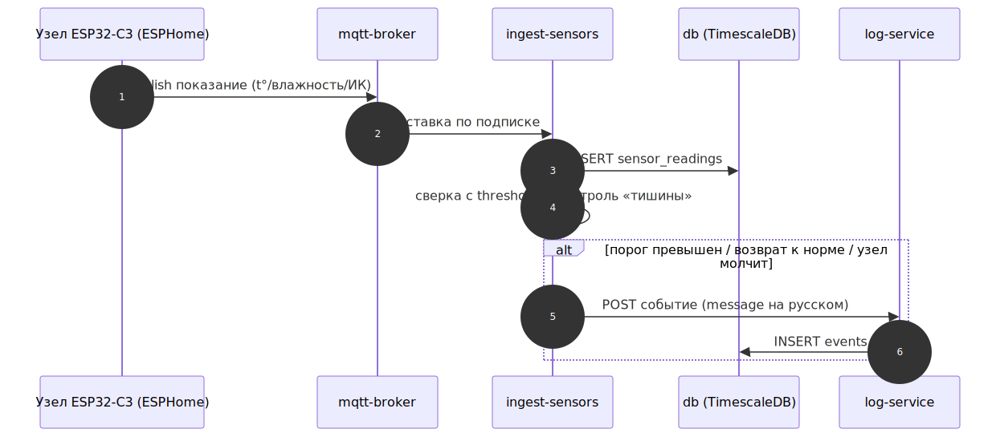
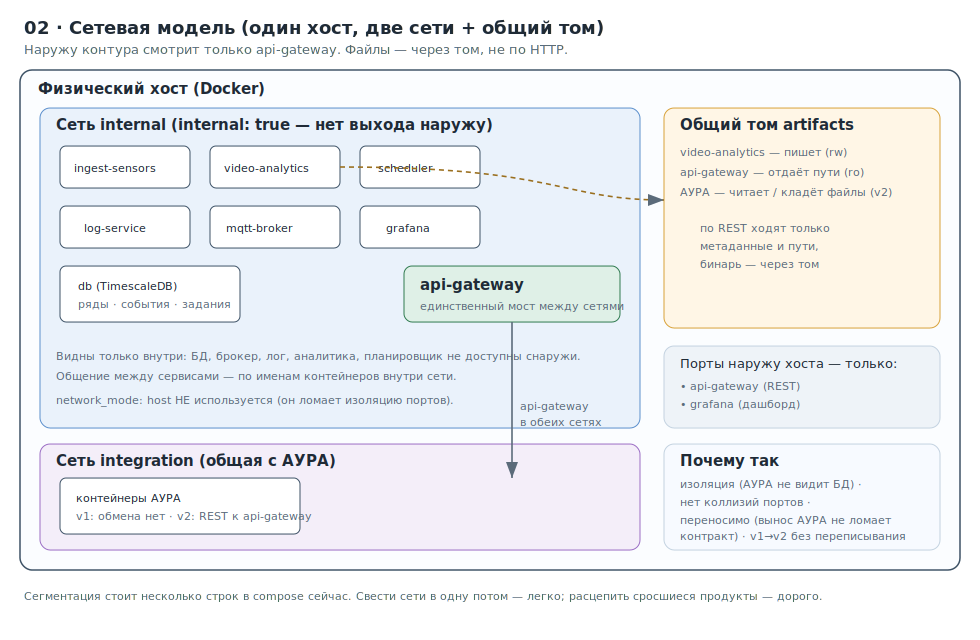
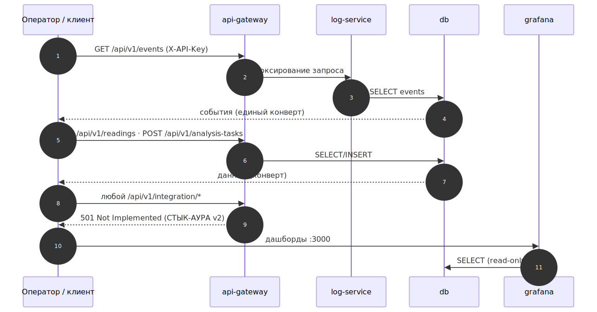

# Комплекс мониторинга помещений — руководство заказчика

Единый документ для работы с системой: назначение и состав, развёртывание на
сервере объекта, заведение помещений/датчиков/камер, настройка видеоаналитики,
просмотр данных, работа с API, эксплуатация и ответы на типичные вопросы.
Документ самодостаточен; схемы — в папке `diagrams/` рядом с ним.

**Содержание**

1. [О системе](#1-о-системе)
2. [Состав и архитектура](#2-состав-и-архитектура)
3. [Сетевая модель и доступ](#3-сетевая-модель-и-доступ)
4. [Защита кода и данных](#4-защита-кода-и-данных)
5. [Требования к серверу и сети](#5-требования-к-серверу-и-сети)
6. [Установка и первый запуск](#6-установка-и-первый-запуск)
7. [Конфигурационные файлы](#7-конфигурационные-файлы)
8. [Заведение объекта: помещения, датчики, камеры](#8-заведение-объекта-помещения-датчики-камеры)
9. [Камеры и медиа-шлюз](#9-камеры-и-медиа-шлюз)
10. [Веб-интерфейс настройки видеоаналитики](#10-веб-интерфейс-настройки-видеоаналитики)
11. [Что распознаёт видеоаналитика](#11-что-распознаёт-видеоаналитика)
12. [Датчики и события](#12-датчики-и-события)
13. [Дашборды (Grafana)](#13-дашборды-grafana)
14. [Работа с API](#14-работа-с-api)
15. [Эксплуатация](#15-эксплуатация)
16. [Граница версий v1 / v2](#16-граница-версий-v1--v2)
17. [Типичные вопросы и проблемы](#17-типичные-вопросы-и-проблемы)
- [Приложение A. Контракт MQTT (датчики)](#приложение-a-контракт-mqtt-датчики)
- [Приложение B. Справочник эндпойнтов API](#приложение-b-справочник-эндпойнтов-api)
- [Приложение C. Типы событий](#приложение-c-типы-событий)

---

## 1. О системе

Система ведёт мониторинг помещений на объекте. В каждом помещении установлены
датчики (температура воздуха, влажность, бесконтактная ИК-температура поверхности)
и камеры. Все данные сводятся на **один сервер на объекте**, где в контейнерах
работает наше программное обеспечение:

- **сбор показаний датчиков** и их накопление в базе данных (временные ряды);
- **видеоаналитика** по видеопотоку камер: распознавание поз и действий человека,
  расчёт процента покрытия рабочих зон, эвристика «спецодежда / белый халат»;
- **единый журнал событий**: и датчики, и видеоаналитика порождают **события** с
  готовым человекочитаемым сообщением для оператора;
- **дашборды** для просмотра показаний и событий;
- **веб-интерфейс настройки** видеоаналитики.

**Границы системы.** Система отдаёт наружу **события**, а не «сырьё»: не ведёт
видеозапись и не выгружает сырые ряды датчиков во внешние системы. Видеозапись,
технологические карты, контроль производства и программа производственного
контроля — функции продукта АУРА и в наш контур не входят. В версии 1 наш контур
работает **самостоятельно** и с АУРА не обменивается (архитектурно к этому готов —
см. [§16](#16-граница-версий-v1--v2)).

---

## 2. Состав и архитектура

Система — это набор контейнеров Docker на одном сервере.


*Топология: датчики и камеры в помещениях сводятся на сервер объекта.*



*Состав: контейнеры, сети и тома.*

| Компонент | Назначение |
|---|---|
| **Внешний шлюз (API)** | единственный внешний REST-вход и веб-интерфейс настройки |
| **Дашборды (Grafana)** | просмотр показаний и журнала событий |
| **База данных (TimescaleDB)** | ряды датчиков, события, задания, справочники объекта |
| **Брокер (MQTT)** | приём показаний от узлов датчиков |
| **Приём датчиков** | запись показаний в базу, контроль «тишины» узлов |
| **Медиа-шлюз** | приём видеопотоков камер (RTSP/ONVIF), кадр-превью |
| **Видеоаналитика** | распознавание, события, скриншоты-доказательства |
| **Планировщик** | запуск видеоанализа по расписанию |
| **Журнал событий** | единое хранение событий от датчиков и аналитики |

Данные о датчиках поступают так:



Видеоанализ по расписанию:


---

## 3. Сетевая модель и доступ

Контейнеры разнесены по внутренним сетям; **наружу сервера опубликованы только
необходимые порты**.



| Порт | Сервис | Назначение | Куда открыт |
|---|---|---|---|
| `8000` | внешний шлюз (API) | REST-вход и веб-интерфейс настройки | LAN объекта |
| `3000` | Grafana | дашборды оператора | LAN объекта |
| `1883` | MQTT-брокер | приём показаний от узлов датчиков | LAN объекта |

Все остальные сервисы (база данных, журнал, приём датчиков, планировщик,
видеоаналитика, медиа-шлюз) работают только во внутренней сети и снаружи **не
видны**. Доступ к API и веб-интерфейсу защищён ключом (см. [§14](#14-работа-с-api)).

Внешний доступ (REST и дашборды):



---

## 4. Защита кода и данных

Честно о пределах защиты, поскольку сервер находится во владении заказчика.

- **Полностью закрыть исходный код от владельца сервера технически нельзя.** Тот,
  у кого есть административный доступ к серверу, в принципе может извлечь
  содержимое контейнеров. Контейнер обеспечивает изоляцию выполнения, а не
  «непрочитываемость» кода.
- **Что мы делаем технически** (чтобы поднять планку): сборка образов так, что в
  рабочий образ не попадают исходники, тесты и секреты; минимальный runtime без
  лишних инструментов; для сервисов с нашей основной логикой — компиляция в
  нативный бинарь (закрытый профиль сборки). Это превращает «открыл и прочитал» в
  «целенаправленно дизассемблируй», но не делает реверс невозможным.
- **Что является реальной гарантией** в ситуации «ПО на сервере заказчика» —
  **юридический контур**: лицензионное соглашение и NDA. Именно договор, а не
  контейнер, делает несанкционированное использование кода неправомерным.
- **Секреты** (пароли, ключи) в образах не хранятся — только в файле окружения
  `.env` на сервере и в переменных окружения контейнеров.

---

## 5. Требования к серверу и сети

- **Сервер на объекте:** Linux x86-64, установленные **Docker** и
  **Docker Compose v2**. Для видеоаналитики на нескольких камерах — несколько ядер
  CPU; видеокарта (GPU) **не требуется**.
- **Сеть LAN:** узлы датчиков (контроллеры) и камеры — в одной сети с сервером.
- Доступа в интернет для работы версии 1 не требуется (контур автономен).

---

## 6. Установка и первый запуск

Все команды выполняются из каталога с системой (где лежит `docker-compose.yml`).

### 6.1 Получить дистрибутив и настроить окружение

```bash
# 1. Распаковать/склонировать дистрибутив, перейти в каталог
cd monitoring

# 2. Создать файл окружения из примера
cp .env.example .env
```

Откройте `.env` и **обязательно задайте секреты** (не оставляйте `change-me`):

| Переменная | Назначение |
|---|---|
| `POSTGRES_PASSWORD` | пароль основного пользователя базы данных |
| `POSTGRES_RO_PASSWORD` | пароль пользователя «только чтение» для Grafana |
| `API_KEY` | значение ключа `X-API-Key` для доступа к API и веб-интерфейсу |
| `GF_SECURITY_ADMIN_PASSWORD` | пароль администратора Grafana |

Остальные переменные имеют рабочие значения по умолчанию (полный список с
комментариями — в `.env.example`).

### 6.2 Подготовить ассеты объекта

1. **Модель распознавания поз** — положите файл `models/pose_landmarker.task`.
   Без него сервис видеоаналитики не запустится.
2. **Камеры** — опишите видеопотоки объекта в `media-gateway/go2rtc.yaml`
   (см. [§9](#9-камеры-и-медиа-шлюз)).
3. **Расписания видеоанализа** — `config/schedules.json`
   (см. [§11](#11-что-распознаёт-видеоаналитика)).

### 6.3 Поднять систему

```bash
docker compose up -d
docker compose ps        # все сервисы healthy; служба миграций — exited (0)
```

Система сама выдерживает порядок запуска: база данных → применение схемы
(миграции) → прикладные сервисы.



### 6.4 Засеять справочники объекта

См. [§8](#8-заведение-объекта-помещения-датчики-камеры).

### 6.5 Проверка работоспособности

```bash
# Ключ из .env
KEY="<значение API_KEY>"

# REST-вход
curl -H "X-API-Key: $KEY" http://localhost:8000/api/v1/health

# Веб-интерфейс настройки — в браузере:
#   http://<сервер>:8000/ui/
# Дашборды — в браузере:
#   http://<сервер>:3000   (логин admin / GF_SECURITY_ADMIN_PASSWORD)
```

---

## 7. Конфигурационные файлы

Всё, что настраивается под конкретный объект, собрано в нескольких файлах. Файлы с
секретами и реальными адресами не входят в дистрибутив — рядом лежат образцы
(`*.example`).

| Что настраиваете | Файл | Образец |
|---|---|---|
| Секреты и параметры окружения | `.env` | `.env.example` |
| Справочник объекта (помещения, узлы, камеры) | `db/seeds/object.yaml` | `db/seeds/object.example.yaml` |
| Камеры для медиа-шлюза (RTSP/ONVIF) | `media-gateway/go2rtc.yaml` | входит в дистрибутив |
| Расписания видеоанализа | `config/schedules.json` | `config/schedules.example.json` |
| Модель распознавания поз | `models/pose_landmarker.task` | внешний ассет |
| Прошивки узлов датчиков | свои копии | `firmware/esphome/*.example.yaml` |

---

## 8. Заведение объекта: помещения, датчики, камеры

Помещения, узлы датчиков и камеры образуют **справочник объекта**. Он заполняется
из файла `db/seeds/object.yaml` и загружается в базу данных скриптом (повторный
запуск безопасен — записи обновляются по идентификатору).

### 8.1 Заполнить файл объекта

```bash
cp db/seeds/object.example.yaml db/seeds/object.yaml
```

Отредактируйте `db/seeds/object.yaml`:

```yaml
rooms:
  - id: room-01                       # короткий идентификатор (латиницей)
    name: "Помещение для приготовления пищи"
    is_cold: false
  - id: room-02
    name: "Холодильная камера"
    is_cold: true

sensor_nodes:
  - id: node-01
    room_id: room-01                  # ссылка на помещение выше
    placement: "внутри (I2C)"
    power: mains

cameras:
  - id: "11111111-1111-1111-1111-111111111111"   # UUID (сгенерировать: uuidgen)
    room_id: room-01
    name: cam-01                       # ВАЖНО: = имя потока в go2rtc.yaml (см. §9)
    rtsp_url: "rtsp://camera.local/stream"
    enabled: true
```

### 8.2 Загрузить в базу данных

```bash
# Проверка без записи (показывает, что будет добавлено):
DATABASE_URL=postgresql+psycopg2://monitoring:<POSTGRES_PASSWORD>@localhost:5432/monitoring \
  python scripts/seed.py db/seeds/object.yaml

# Применить:
DATABASE_URL=postgresql+psycopg2://monitoring:<POSTGRES_PASSWORD>@localhost:5432/monitoring \
  python scripts/seed.py db/seeds/object.yaml --apply
```

После загрузки камеры появляются в веб-интерфейсе ([§10](#10-веб-интерфейс-настройки-видеоаналитики)).
Отдельную камеру можно также завести прямо из веб-интерфейса (без правки файла).

---

## 9. Камеры и медиа-шлюз

Видеопотоки камер принимает медиа-шлюз. Опишите камеры в
`media-gateway/go2rtc.yaml`:

```yaml
streams:
  cam-01: rtsp://camera.local/stream    # имя потока (cam-01) = поле name камеры
```

**Ключевая связка:** имя потока в `go2rtc.yaml` должно совпадать с полем `name`
камеры в справочнике объекта. По этому имени веб-интерфейс запрашивает кадр-превью
для разметки рабочих зон; при несовпадении кадр не загрузится.

---

## 10. Веб-интерфейс настройки видеоаналитики

Откройте в браузере: **`http://<сервер>:8000/ui/`**

1. В шапке введите **ключ доступа** — это значение `API_KEY` из `.env`. Ключ
   сохранится в браузере.
2. Нажмите **«Загрузить камеры»**. Если список пуст — заведите камеру кнопкой
   **«Добавить камеру»** (помещение, имя = поток в медиа-шлюзе, адрес `rtsp://…`)
   или загрузите справочник объекта ([§8](#8-заведение-объекта-помещения-датчики-камеры)).
3. Выберите камеру:
   - флажок **«камера включена»** — общий выключатель аналитики камеры;
   - флажки функций: **позы / действия / спецодежда / покрытие**;
   - **«Сохранить настройки»**.
4. **Разметка рабочих зон (ROI)** для расчёта процента покрытия:
   - **«Загрузить кадр»** — подтянется текущий кадр камеры;
   - кликами по кадру обведите многоугольник зоны (не менее 3 вершин);
   - выберите **тип зоны** (стол / пол / окно) и нажмите **«Сохранить зону»**;
   - зоны видны в таблице ниже, есть кнопка удаления.

Изменения учитываются видеоаналитикой при следующем задании. Без размеченных зон
аналитика работает, просто не считает процент покрытия.

---

## 11. Что распознаёт видеоаналитика

Видеоаналитика работает по видеопотоку камеры (в реальном времени, на CPU) и
выдаёт **события**, а не видео. Распознаётся одна модель скелета человека (33 точки
тела). Набор распознаваемого:

**Простые позы** (с порогами и защитой от дребезга):
- руки: поднята правая/левая рука (над головой / вверх / в сторону), опущена,
  подняты обе руки;
- ноги: поднято левое/правое колено;
- голова: повёрнута влево/вправо/прямо;
- корпус: приседание и подъём, наклон корпуса влево/вправо.

**Составные действия** (со скользящим окном и длительностью):
- протирание поверхности (требуются движения двумя руками в зоне «стол»);
- помахивание рукой; хлопок в ладоши; ходьба на месте.

**Процент покрытия рабочих зон (ROI).** По размеченным вручную зонам (стол / пол /
окно) раз в секунду считается доля площади зоны, покрытая движением. Результат —
событие вида «Покрытие зоны стола — 63 %».

**Эвристика спецодежды («белый халат»).** По области торса оценивается яркость и
насыщенность: белый халат = высокая яркость + низкая насыщенность. Может
использоваться как индикатор, событие в журнал или условие (засчитывать уборку
только если человек в форме).

> **Честные ограничения эвристики спецодежды:** возможны ошибки на фоне белой
> стены/нержавейки и при пересвете; метод не отличает халат от белого фартука или
> футболки. Для сигнала годится, для строгого контроля — слабо. Более устойчивый
> вариант (обученный детектор СИЗ) — задел на будущую версию.

Каждое задание видеоанализа проходит жизненный цикл со статусами:


Видеоанализ запускается **по расписанию** (`config/schedules.json`): каждая запись
задаёт камеру, помещение и интервал. Помимо расписания, задание можно поставить
вручную через API ([§14](#14-работа-с-api)).

---

## 12. Датчики и события

Узлы датчиков сами публикуют показания в брокер (сервер их не опрашивает). Сервис
приёма записывает показания в базу и формирует **события** по критериям:
превышение порога, возврат в норму, «тишина» узла (нет показаний дольше
допустимого). Формат сообщений датчиков — [Приложение A](#приложение-a-контракт-mqtt-датчики).

Путь события от источника до журнала:


Каждое событие несёт готовую фразу для оператора на русском (поле `message`) и
машинные детали (`payload`). Полный перечень типов событий —
[Приложение C](#приложение-c-типы-событий).

---

## 13. Дашборды (Grafana)

Откройте **`http://<сервер>:3000`**, войдите как `admin` с паролем
`GF_SECURITY_ADMIN_PASSWORD` из `.env`. Дашборды (показания датчиков, журнал
событий) преднастроены. Grafana читает базу данных в режиме «только чтение».

---

## 14. Работа с API

Внешний доступ к данным и настройкам — через REST API внешнего шлюза.
Интерактивная спецификация всегда доступна у работающего сервера:
**`http://<сервер>:8000/docs`**.

### 14.1 Аутентификация

Запросы требуют заголовок **`X-API-Key`** со значением переменной **`API_KEY`** из
`.env` сервера. Этот ключ заказчик назначает сам при развёртывании. Тот же ключ
вводится в веб-интерфейсе. Неверный или отсутствующий ключ → ответ `401`.

### 14.2 Формат ответа

Все ответы обёрнуты в единый «конверт»:

```json
{ "status": "ok", "data": { "...": "полезная нагрузка" }, "error": null,
  "ts": "2026-06-08T10:30:00Z" }
```

При ошибке: `status:"error"`, `data:null`, `error:{ "code":"...", "message":"..." }`.
Коды ошибок: `VALIDATION_ERROR` (422), `UNAUTHORIZED` (401), `TASK_NOT_FOUND`,
`EVENT_NOT_FOUND`, `CAMERA_NOT_FOUND`, `ZONE_NOT_FOUND` (404), `NOT_IMPLEMENTED`
(501), `INTERNAL` (500). Изображения (кадр-превью) отдаются как `image/jpeg`, без
конверта.

### 14.3 Примеры запросов

```bash
KEY="<значение API_KEY>"; H="X-API-Key: $KEY"; BASE="http://localhost:8000/api/v1"

# Здоровье сервиса
curl -H "$H" $BASE/health

# Журнал событий (фильтры: from, to, type, room, limit, offset)
curl -H "$H" "$BASE/events?room=room-02&type=threshold_exceeded&limit=50"

# Показания датчиков (для проверки/интеграций; основной просмотр — Grafana)
curl -H "$H" "$BASE/readings?room=room-01&metric=air_temp&from=2026-06-01T00:00:00Z"

# Поставить разовое задание видеоанализа (помимо расписания)
curl -H "$H" -H "Content-Type: application/json" -X POST $BASE/analysis-tasks -d '{
  "source_type": "stream",
  "source_ref": "rtsp://camera.local/stream",
  "room": "room-01",
  "camera_id": "11111111-1111-1111-1111-111111111111",
  "pipeline": "pose_v1"
}'

# Статус/результат задания
curl -H "$H" $BASE/analysis-tasks/<task-id>

# Камеры и зоны (то же делает веб-интерфейс)
curl -H "$H" $BASE/cameras
curl -H "$H" -X POST $BASE/cameras -H "Content-Type: application/json" \
  -d '{ "room": "room-01", "name": "cam-09", "rtsp_url": "rtsp://cam-09/stream" }'
curl -H "$H" -X PATCH $BASE/cameras/<id> -H "Content-Type: application/json" \
  -d '{ "enabled": true, "analytics": { "coverage": true } }'
curl -H "$H" -X POST $BASE/cameras/<id>/zones -H "Content-Type: application/json" \
  -d '{ "zone_type": "table", "polygon": [[0.1,0.1],[0.5,0.1],[0.5,0.5]] }'
```

Полный перечень эндпойнтов — [Приложение B](#приложение-b-справочник-эндпойнтов-api).
Кто кому что шлёт внутри системы:


---

## 15. Эксплуатация

### Запуск, остановка, перезапуск

```bash
docker compose up -d                 # поднять весь контур
docker compose ps                    # состояние и healthcheck'и
docker compose restart <сервис>      # перезапуск одного сервиса
docker compose down                  # остановить (данные в томах сохраняются)
# docker compose down -v             # ВНИМАНИЕ: -v удаляет данные! Не для прода
```

### Логи

```bash
docker compose logs -f --tail=200 <сервис>   # логи сервиса (сообщения на русском)
docker compose logs -f                        # все сервисы
```

### Бэкап и восстановление базы данных

```bash
# Бэкап (сжатый дамп)
docker compose exec -T db \
  pg_dump -U "$POSTGRES_USER" -d "$POSTGRES_DB" -Fc > backup_$(date +%F).dump

# Восстановление
docker compose exec -T db \
  pg_restore -U "$POSTGRES_USER" -d "$POSTGRES_DB" --clean --if-exists < backup_<дата>.dump
```

Рекомендуется: бэкап по расписанию, хранение копий вне сервера, периодическая
проверка восстановления.

### Артефакты (скриншоты-доказательства)

Кадры-доказательства видеоаналитики хранятся на томе `artifacts`
(`/data/artifacts/<дата>/<id>.<расш>`). В журнал/задание пишется **ссылка** (путь),
сам файл — на томе. Чистка старых файлов:

```bash
docker compose exec video-analytics find /data/artifacts -type f -mtime +30 -delete
```

### Тома данных

| Том | Что хранит | Терять нельзя |
|---|---|---|
| `db_data` | база данных (ряды, события, задания) | да |
| `artifacts` | скриншоты-доказательства | желательно |
| `mqtt_data` | состояние брокера | нет (кэш) |
| `grafana_data` | состояние Grafana | нет |

### Обновление версии

```bash
docker compose build                 # пересобрать образы новой версии
docker compose run --rm migrate      # применить новые миграции схемы БД
docker compose up -d                 # перезапустить сервисы
```

---

## 16. Граница версий v1 / v2

В версии 1 наш контур **самостоятелен**. Разъёмы интеграции с АУРА
(`/api/v1/integration/*`) физически присутствуют, но **выключены** и отвечают
`501 NOT_IMPLEMENTED`. Их включение в версии 2 — переключением настройки, без
изменения адресов и без переустановки. В версии 1:

- показания датчиков в АУРА **не передаются** (копятся только в нашей базе);
- наружу контур отдаёт **события**, а не сырые ряды и не видеозапись;
- видеоанализ запускается по нашему расписанию (в версии 2 — дополнительно по
  команде АУРА, в том числе по переданному видеофайлу).

---

## 17. Типичные вопросы и проблемы

| Симптом | Причина и решение |
|---|---|
| В веб-интерфейсе пустой список камер | Камеры ещё не заведены — добавьте камеру в интерфейсе («Добавить камеру», §10) или загрузите справочник объекта (§8). |
| `401` на запросах к API | Неверный ключ. Используйте значение `API_KEY` из `.env` сервера (§14.1). |
| «Кадр недоступен» при разметке зон | Имя камеры не совпадает с именем потока в `go2rtc.yaml`, либо камера недоступна (§9). |
| Сервис видеоаналитики не запускается | Нет файла модели `models/pose_landmarker.task` (§6.2). |
| Нет событий покрытия зон | Не размечены рабочие зоны камеры — добавьте зоны в интерфейсе (§10). |
| Эндпойнт `/integration/*` отвечает `501` | Это норма для версии 1: интеграция с АУРА выключена (§16). |

---

## Приложение A. Контракт MQTT (датчики)

Узлы датчиков сами публикуют показания в брокер. Базовый префикс топиков задаётся
переменной `MQTT_TOPIC_PREFIX` (по умолчанию `monitoring`).

**Топики:**

| Назначение | Топик |
|---|---|
| Показание метрики | `<префикс>/<node_id>/<metric>` |
| Доступность узла | `<префикс>/<node_id>/status` |

- `<node_id>` — идентификатор узла из справочника (например `node-01`);
- `<metric>` — одна из метрик: `air_temp` | `humidity` | `surface_ir`;
- помещение определяется на сервере по связи узла с помещением (в payload не
  передаётся).

**Payload показания** (JSON, UTF-8):

```json
{ "value": 8.7, "unit": "C", "ts": "2026-06-05T10:30:00Z" }
```

| Поле | Тип | Обяз. | Смысл |
|---|---|:--:|---|
| `value` | число | да | значение метрики |
| `unit` | строка | да | единица: `C` (°C) или `%` |
| `ts` | строка (ISO-8601 UTC) | нет | момент измерения; если нет — берётся время приёма |

**Примеры:**

```
monitoring/node-01/air_temp     {"value": 23.4, "unit": "C"}
monitoring/node-01/humidity     {"value": 41.0, "unit": "%"}
monitoring/node-01/surface_ir   {"value": 4.2,  "unit": "C", "ts": "2026-06-05T10:30:00Z"}
monitoring/node-02/status       online
```

`surface_ir` — бесконтактная ИК-температура поверхности. Некорректные сообщения
сервис логирует и пропускает, не прерывая работу.

---

## Приложение B. Справочник эндпойнтов API

Базовый префикс: `/api/v1`. Все эндпойнты требуют заголовок `X-API-Key`.

| Метод | Путь | Назначение |
|---|---|---|
| GET | `/health` | проверка живости сервиса |
| GET | `/events` | журнал событий (фильтры: `from`, `to`, `type`, `room`, `limit`, `offset`) |
| GET | `/events/{id}` | одно событие |
| POST | `/analysis-tasks` | поставить задание видеоанализа |
| GET | `/analysis-tasks` | список заданий (фильтры: `status`, `from`, `to`) |
| GET | `/analysis-tasks/{id}` | статус/результат задания |
| GET | `/readings` | показания датчиков (`room`, `metric`, `from`, `to`, `limit`) |
| GET | `/cameras` | список камер |
| POST | `/cameras` | завести камеру в справочнике |
| GET | `/cameras/{id}` | камера по id |
| PATCH | `/cameras/{id}` | включение камеры и тумблеры функций аналитики |
| GET | `/cameras/{id}/snapshot` | JPEG-кадр камеры (фон для разметки зон) |
| GET | `/cameras/{id}/zones` | рабочие зоны камеры |
| POST | `/cameras/{id}/zones` | создать рабочую зону |
| PATCH | `/zones/{id}` | изменить зону |
| DELETE | `/zones/{id}` | удалить зону |
| — | `/integration/*` | разъёмы для АУРА — в версии 1 отвечают `501` |

**Тело `POST /analysis-tasks`:** `source_type` (`stream`|`file`), `source_ref`
(адрес потока или путь к файлу), `room`, `camera_id` (опц. — применит настройки
камеры), `pipeline` (`pose_v1`), `params` (опц.).

**Тело `POST /cameras`:** `room`, `name` (= имя потока в медиа-шлюзе), `rtsp_url`,
`enabled` (опц.).

**Тело `PATCH /cameras/{id}`:** `enabled` (опц.), `analytics` (опц., тумблеры
`pose`/`actions`/`uniform`/`coverage`; отсутствие ключа = функция включена).

**Тело `POST /cameras/{id}/zones`:** `zone_type` (`table`|`floor`|`window`),
`polygon` (≥3 вершин, координаты нормированы в диапазоне [0..1]), `note` (опц.).

---

## Приложение C. Типы событий

| Источник | Тип | Смысл | Пример сообщения |
|---|---|---|---|
| датчики | `threshold_exceeded` | показание вышло за порог | «В холодильной камере температура выше нормы» |
| датчики | `back_to_normal` | показание вернулось в норму | «Влажность вернулась к норме» |
| датчики | `sensor_silent` | узел молчит дольше допустимого | «Датчик в холодильной камере молчит 12 минут» |
| аналитика | `pose_event` | простая поза | «Поднята правая рука» |
| аналитика | `action_detected` | составное действие с длительностью | «Протирание поверхности двумя руками, 4 с» |
| аналитика | `coverage_report` | процент покрытия рабочей зоны | «Покрытие зоны стола — 63 %» |
| аналитика | `condition_flagged` | эвристика спецодежды | «Не распознана спецодежда (белый халат)» |

Поле `message` — готовая фраза для оператора (на русском), `payload` — машинные
детали (метрика, значение, порог, длительность, идентификаторы зоны и т.п.).
