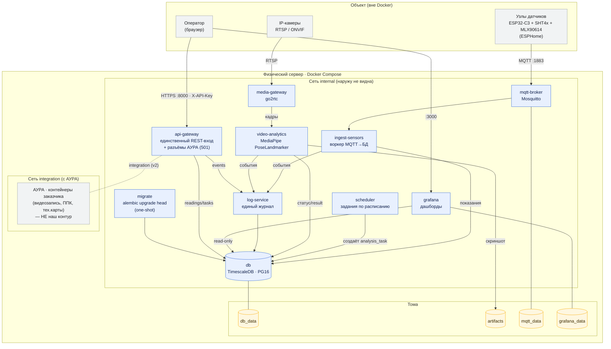

# 06 · Состав продукта (компоненты)

Из чего состоит контур: контейнеры, сети, тома, что опубликовано наружу.
Источник истины — [`docs/01_ARCHITECTURE.md`](../01_ARCHITECTURE.md) и
[`docker-compose.yml`](../../docker-compose.yml). Диаграмма рендерится на GitHub
(Mermaid); правится прямо в этом файле в одном PR с кодом (эпик E8).

## Что опубликовано наружу

| Порт | Контейнер | Назначение |
|---|---|---|
| `8000` | `api-gateway` | единственный внешний REST-вход (защищён `X-API-Key`) |
| `3000` | `grafana` | дашборды оператора |
| `1883` | `mqtt-broker` | приём показаний от узлов датчиков |

Всё остальное (`db`, `migrate`, `log-service`, `ingest-sensors`, `scheduler`,
`video-analytics`, `media-gateway`) живёт только в сети `internal`.

## Граница АУРА (v1)

`api-gateway` подключён к обеим сетям (`internal` + `integration`) как будущий
мост к АУРА, но в v1 разъёмы `/api/v1/integration/*` отвечают `501 Not Implemented`
(фичефлаг `AURA_INTEGRATION_ENABLED=false`). Обмена по сети `integration` нет.
