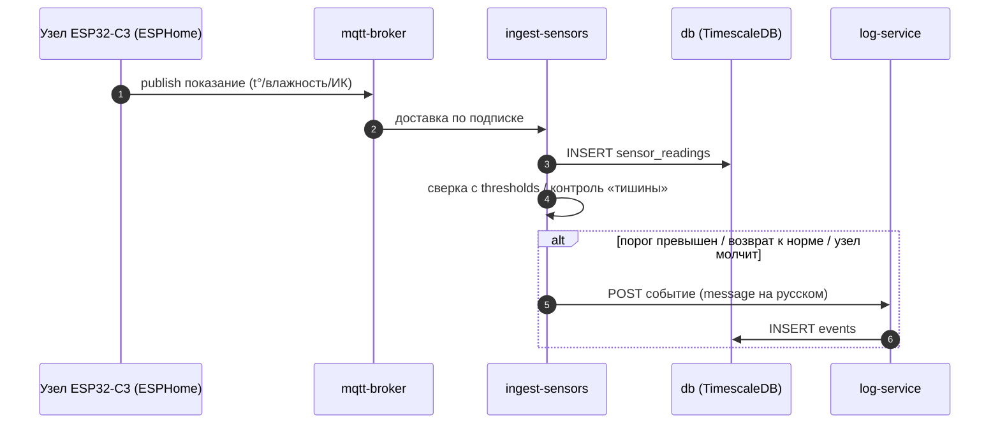
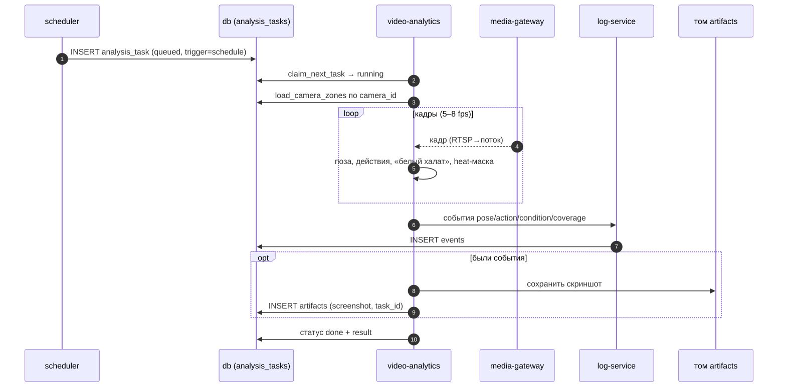
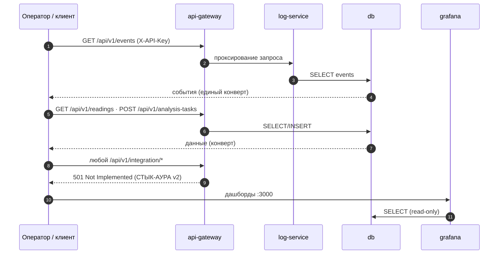
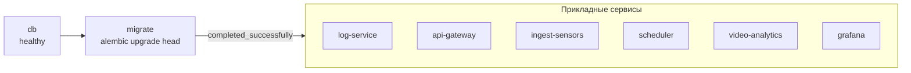

# 07 · Взаимодействие компонентов

Как компоненты работают вместе в основных сценариях v1. Диаграммы Mermaid
рендерятся на GitHub. Контракты — [`docs/03_API_CONTRACT.md`](../03_API_CONTRACT.md)
и [`docs/08_MQTT_CONTRACT.md`](../08_MQTT_CONTRACT.md); процессные `.bpmn`-исходники
(жизненный цикл задания, поток события) — в этом же каталоге.

---

## A. Поток датчиков → показания и события

Узлы сами публикуют в MQTT; сервер их не опрашивает. Показания копятся в БД,
наружу контур отдаёт **события** (по порогам и «тишине»), а не сырые ряды.

---

## B. Видеоаналитика по расписанию

Планировщик создаёт задание; воркер берёт его из очереди, гоняет кадры через
MediaPipe, шлёт события, сохраняет скриншот-доказательство и проставляет статус.

---

## C. Внешний доступ: REST и дашборды

Единственный REST-вход — `api-gateway` (с `X-API-Key`). Grafana читает БД
напрямую под read-only пользователем. Разъёмы АУРА в v1 заглушены.

---

## D. Старт стека (порядок зависимостей)

`docker compose up` сам выдерживает порядок: БД → миграции → прикладные сервисы.

> Подробности развёртывания и проверки — [`docs/10_DEPLOYMENT.md`](../10_DEPLOYMENT.md);
> эксплуатация (бэкап, перезапуск, артефакты) — [`docs/09_OPERATIONS.md`](../09_OPERATIONS.md).
