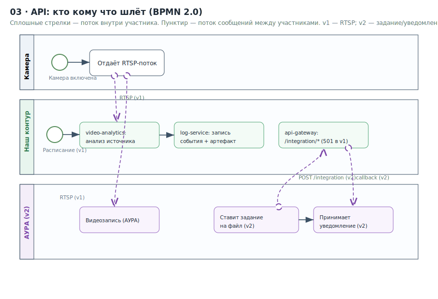
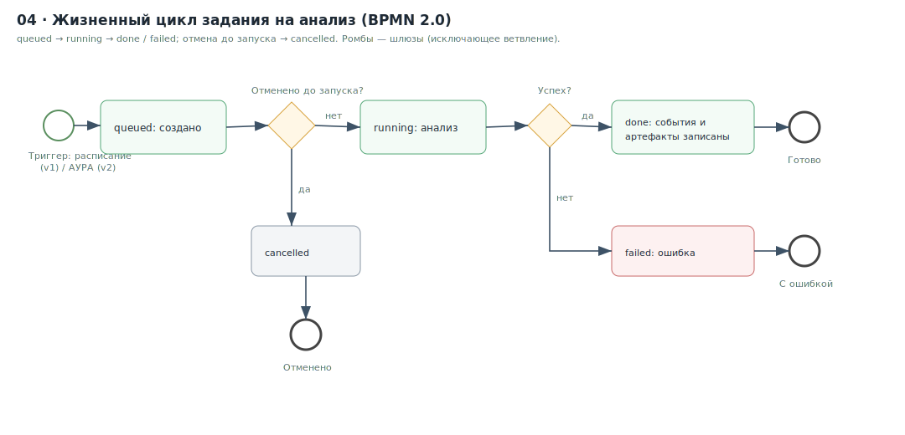
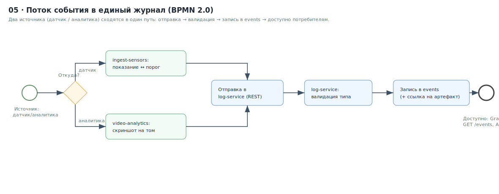

# Диаграммы

## Какая нотация и почему

Запрошены диаграммы в **BPMN 2.0**. BPMN 2.0 — это нотация для **процессов**
(события, задачи, шлюзы, потоки сообщений между участниками). Она прекрасно
ложится на «кто кому что шлёт» и на жизненные циклы. Но **статическую структуру**
(топологию железа, сетевую модель) BPMN не описывает — это не процесс. Поэтому:

| Диаграмма | Нотация | Файлы | Почему |
|---|---|---|---|
| 01 · Топология объекта | архитектурная (SVG) | `01_topology.svg` | статика, не процесс |
| 02 · Сетевая модель | архитектурная (SVG) | `02_network.svg` | статика, не процесс |
| 03 · API: кто кому что шлёт | **BPMN 2.0** | `03_api_collaboration.bpmn` + `.svg` | коллаборация с message flow |
| 04 · Жизненный цикл задания | **BPMN 2.0** | `04_task_lifecycle.bpmn` + `.svg` | процесс со статусами |
| 05 · Поток события в журнал | **BPMN 2.0** | `05_event_flow.bpmn` + `.svg` | процесс |

---

## Превью

### 01 · Топология объекта
Что где стоит и как сводится на сервер. Источник истины — [`docs/01_ARCHITECTURE.md`](../01_ARCHITECTURE.md).

### 02 · Сетевая модель
Две Docker-сети (`internal` / `integration`) и общий том артефактов. Обоснование — [`docs/02_NETWORK.md`](../02_NETWORK.md).

### 03 · API: кто кому что шлёт
Коллаборация участников с потоками сообщений. Контракт — [`docs/03_API_CONTRACT.md`](../03_API_CONTRACT.md).
Исходник: [`03_api_collaboration.bpmn`](03_api_collaboration.bpmn).

### 04 · Жизненный цикл задания на анализ
Статусы `analysis_task` от создания до `done` / `failed`. Модель — [`docs/04_DATA_MODEL.md`](../04_DATA_MODEL.md).
Исходник: [`04_task_lifecycle.bpmn`](04_task_lifecycle.bpmn).

### 05 · Поток события в единый журнал
Путь события от источника (ingest / analytics) до записи в `events`.
Исходник: [`05_event_flow.bpmn`](05_event_flow.bpmn).

---

## Как открыть/редактировать

- **`.bpmn`** — стандарт OMG BPMN 2.0 с разметкой расположения (DI). Открывается и
  редактируется в **Camunda Modeler** (десктоп, бесплатно) или онлайн на
  **demo.bpmn.io**. Это «исходник» процессных диаграмм.
- **`.svg`** — превью для быстрого просмотра (открывается в браузере, вставляется
  в документы). Соответствует одноимённому `.bpmn`.

## Правило поддержки

При изменении процесса/контракта диаграммы обновляются в том же PR, что и код
(эпик E8). `.bpmn` — источник, `.svg` перерисовывается под него.
