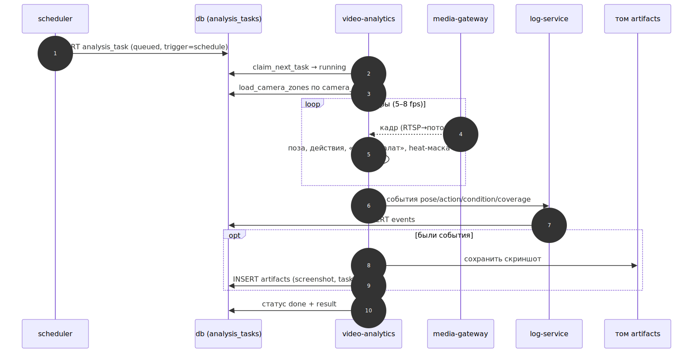
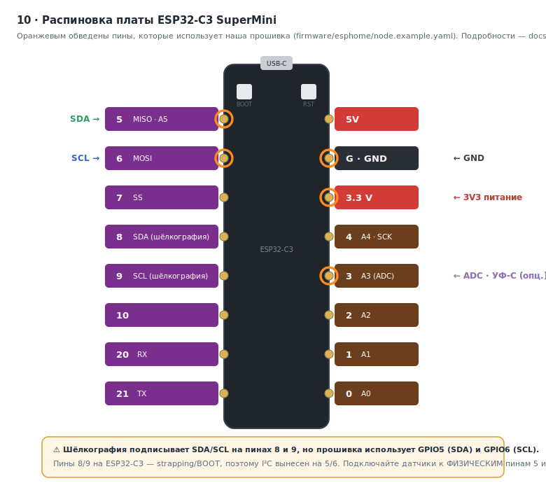

# Диаграммы

## Какая нотация и почему

Запрошены диаграммы в **BPMN 2.0**. BPMN 2.0 — это нотация для **процессов**
(события, задачи, шлюзы, потоки сообщений между участниками). Она прекрасно
ложится на «кто кому что шлёт» и на жизненные циклы. Но **статическую структуру**
(топологию железа, сетевую модель) BPMN не описывает — это не процесс. Поэтому:

| Диаграмма | Нотация | Файлы | Почему |
|---|---|---|---|
| 01 · Топология объекта | архитектурная (SVG) | `01_topology.svg` | статика, не процесс |
| 02 · Сетевая модель | архитектурная (SVG) | `02_network.svg` | статика, не процесс |
| 03 · API: кто кому что шлёт | **BPMN 2.0** | `03_api_collaboration.bpmn` + `.svg` | коллаборация с message flow |
| 04 · Жизненный цикл задания | **BPMN 2.0** | `04_task_lifecycle.bpmn` + `.svg` | процесс со статусами |
| 05 · Поток события в журнал | **BPMN 2.0** | `05_event_flow.bpmn` + `.svg` | процесс |
| 06 · Состав продукта | **Mermaid** | `06_components.md` | компоненты, сети, тома, порты |
| 07 · Взаимодействие компонентов | **Mermaid** | `07_interactions.md` | sequence основных сценариев |
| 08 · Расключение узла датчиков | архитектурная (SVG) | `08_node_wiring.svg` | статика (схема), не процесс |
| 09 · Расключение холодильной камеры | архитектурная (SVG) | `09_cold_chamber_wiring.svg` | статика (монтаж), не процесс |
| 10 · Распиновка платы ESP32-C3 | архитектурная (SVG) | `10_esp32c3_pinout.svg` | статика (физические пины), не процесс |

Схемы 06–07 выполнены в **Mermaid** прямо в Markdown: рендерятся на GitHub без
внешних инструментов и правятся в одном PR с кодом — самый «живой» формат для
состава и взаимодействия реализованного контура.

---

## Превью

### 01 · Топология объекта
Что где стоит и как сводится на сервер. Источник истины — [`docs/01_ARCHITECTURE.md`](../01_ARCHITECTURE.md).

### 02 · Сетевая модель
Две Docker-сети (`internal` / `integration`) и общий том артефактов. Обоснование — [`docs/02_NETWORK.md`](../02_NETWORK.md).

### 03 · API: кто кому что шлёт
Коллаборация участников с потоками сообщений. Контракт — [`docs/03_API_CONTRACT.md`](../03_API_CONTRACT.md).
Исходник: [`03_api_collaboration.bpmn`](03_api_collaboration.bpmn).

### 04 · Жизненный цикл задания на анализ
Статусы `analysis_task` от создания до `done` / `failed`. Модель — [`docs/04_DATA_MODEL.md`](../04_DATA_MODEL.md).
Исходник: [`04_task_lifecycle.bpmn`](04_task_lifecycle.bpmn).

### 05 · Поток события в единый журнал
Путь события от источника (ingest / analytics) до записи в `events`.
Исходник: [`05_event_flow.bpmn`](05_event_flow.bpmn).

### 06 · Состав продукта
Контейнеры, сети (`internal`/`integration`), тома и опубликованные порты.
Источник (правится): [`06_components.md`](06_components.md) (Mermaid).

### 07 · Взаимодействие компонентов
Sequence-диаграммы основных сценариев. Источник: [`07_interactions.md`](07_interactions.md).

**A. Поток датчиков**

**B. Видеоаналитика по расписанию**

**C. Внешний доступ: REST и Grafana**

**D. Старт стека**

### 08 · Расключение узла датчиков
Распиновка ESP32-C3 + датчиков (I²C + аналог УФ-C). Источник истины — прошивка
[`firmware/esphome/node.example.yaml`](../../firmware/esphome/node.example.yaml)
и раздел [`docs/11_HARDWARE.md`](../11_HARDWARE.md).

### 09 · Расключение узла холодильной камеры
Контроллер снаружи, датчики внутри на I²C-шлейфе через уплотнитель. Источник —
[`firmware/esphome/cold_chamber.example.yaml`](../../firmware/esphome/cold_chamber.example.yaml).

### 10 · Распиновка платы ESP32-C3 SuperMini
Физические пины платы с подсветкой тех, что использует прошивка. Важно: SDA/SCL
по шёлкографии на пинах 8/9, а прошивка — на GPIO5/6 (см. [`docs/11_HARDWARE.md`](../11_HARDWARE.md) §2).

---

## Как открыть/редактировать

- **Mermaid (`06`, `07`)** — диаграммы кодом прямо в `.md`; рендерятся на GitHub,
  правятся в любом редакторе, превью — на **mermaid.live**.
- **`.bpmn`** — стандарт OMG BPMN 2.0 с разметкой расположения (DI). Открывается и
  редактируется в **Camunda Modeler** (десктоп, бесплатно) или онлайн на
  **demo.bpmn.io**. Это «исходник» процессных диаграмм.
- **`.svg`** — превью для быстрого просмотра (открывается в браузере, вставляется
  в документы). Соответствует одноимённому `.bpmn`.

## Правило поддержки

При изменении процесса/контракта диаграммы обновляются в том же PR, что и код
(эпик E8). `.bpmn` — источник, `.svg` перерисовывается под него.
